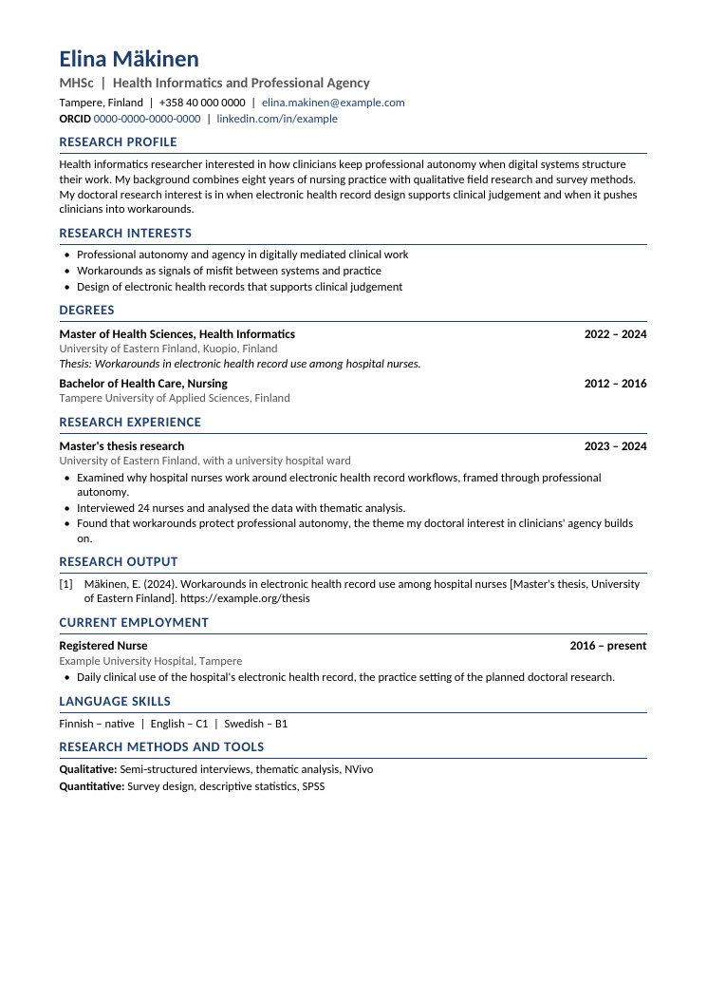

# Finland Academic CV skill

A Claude skill that builds an **academic or researcher CV for Finnish universities and research funders** (doctoral programmes, postdoc and research posts, Research Council of Finland calls) as an editable Word file plus a PDF.

It follows the [TENK researcher CV template](https://tenk.fi/en/advice-and-materials/template-researchers-curriculum-vitae), the Finnish national standard, and writes every bullet to support the person's **research profile and interests**. It does not use a job-CV "responsibilities and results" split.



*Example with made-up data ([PDF](finland-academic-cv/examples/example_academic_cv.pdf), [input JSON](finland-academic-cv/examples/example_academic_cv.json)).*

## How it writes the CV

- **Anchor first:** a Research Profile and 3-5 Research Interests at the top. Everything below is written to support them.
- **Question, approach, insight:** each research bullet says what was studied, how (design, sample, methods, theory), and what it showed or taught that feeds the research agenda.
- **Work roles by relevance:** relevant roles get bullets on what grounds the research, such as practice experience, field access or methods. Older unrelated roles get one line each.
- **TENK section order** with English and Finnish headings: Degrees, Language Skills, Current Employment, Previous Work Experience, Research Funding, Research Output, Supervision, Teaching, Awards, Other Academic Merits, Impact. Early-career applicants can add Research Experience and move it up.
- **Header:** name alone on the first line and ORCID, with no CV date, date of birth, ID number or photo.
- **Numbered publications** in one citation style, with DOIs. Ministry publication type codes are added only if a call asks for them.
- **Honesty rules:** no invented findings, publications or peer-review status, and a thesis is never presented as a journal article. Every sentence linking an experience to the profile is listed for the person to check. TENK notes that misrepresenting merits can be investigated as research misconduct.

For industry jobs in Finland, use the companion skill: [CVFinLandATS](https://github.com/MohaAya/CVFinLandATS).

## Install

**Claude (claude.ai / desktop):** zip the `finland-academic-cv` folder and upload it in Claude's skills settings, or give Claude the link to this repository and ask it to install the skill.

**Claude Code:**

```bash
git clone https://github.com/MohaAya/FinlandCV_Academic.git
cp -r FinlandCV_Academic/finland-academic-cv ~/.claude/skills/
```

Then attach your current CV and ask: *"Make my academic CV for a doctoral position in Finland."* Include the call text if you have it.

## Run the script yourself

Requires Node.js with the `docx` package, and LibreOffice for the PDF:

```bash
npm install docx
node finland-academic-cv/scripts/build_academic_cv.js finland-academic-cv/examples/example_academic_cv.json My_Academic_CV.docx
soffice --headless --convert-to pdf My_Academic_CV.docx
```

The input format is documented in [`finland-academic-cv/SKILL.md`](finland-academic-cv/SKILL.md).

## Sources

- [TENK: Template for researcher's curriculum vitae](https://tenk.fi/en/advice-and-materials/template-researchers-curriculum-vitae)
- [TENK CV template 2020 (PDF)](https://tenk.fi/sites/default/files/2021-06/TENK_CV_template_2020.pdf)

## License

MIT
